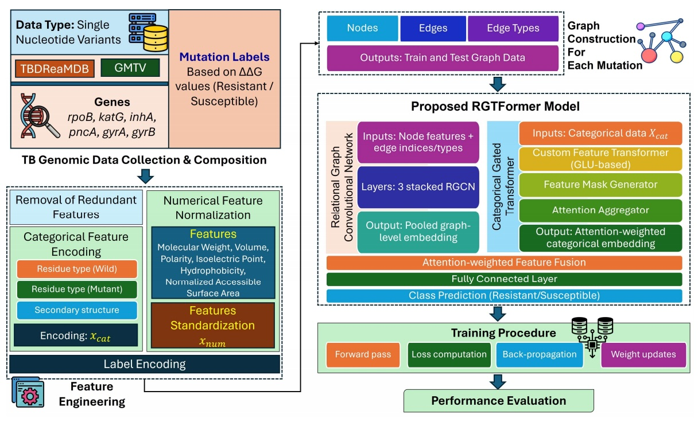
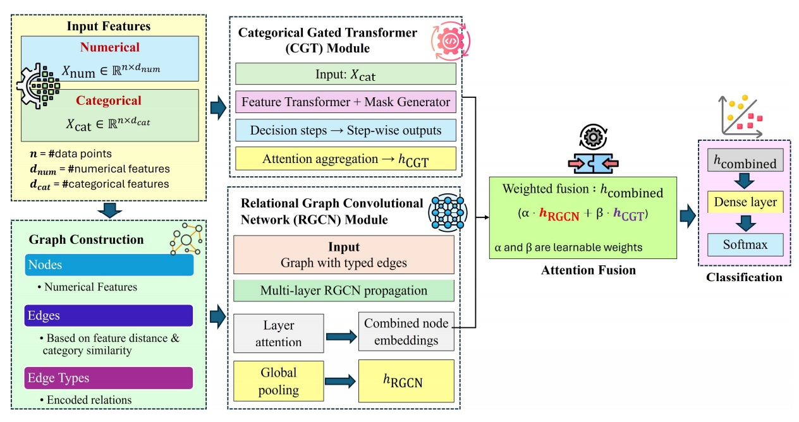
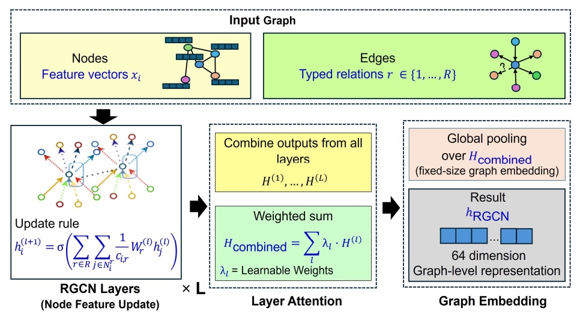
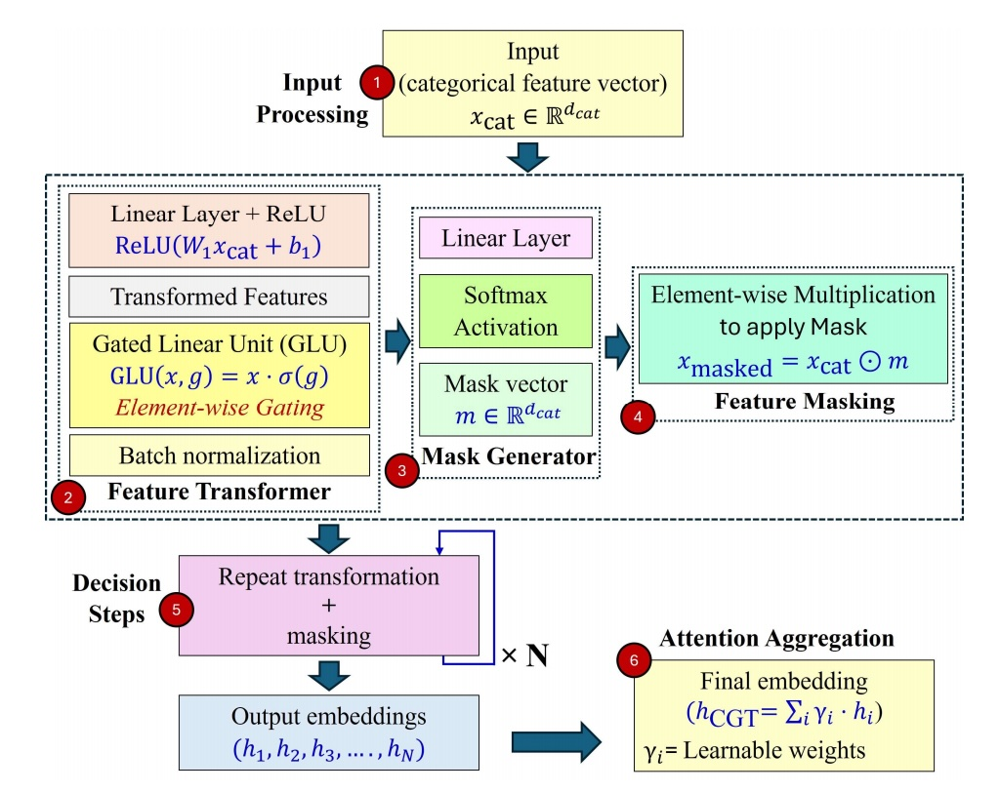
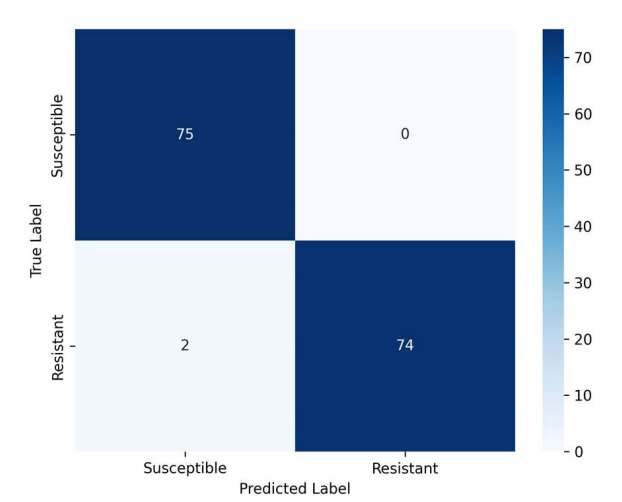
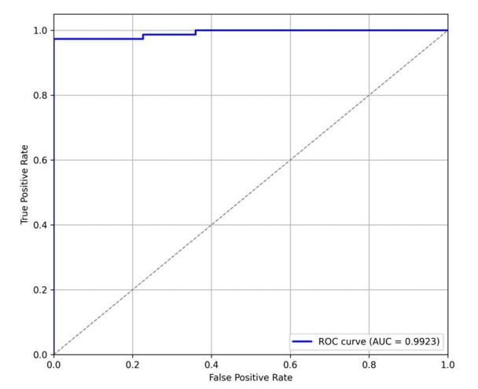
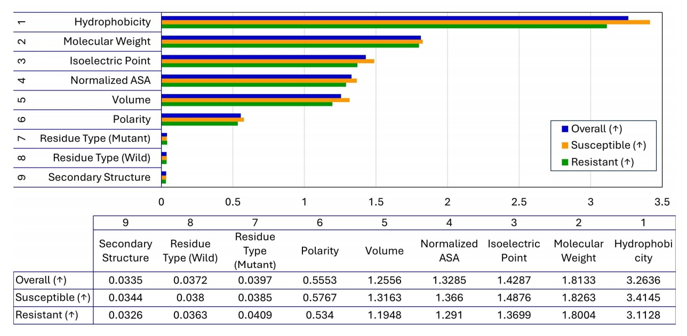
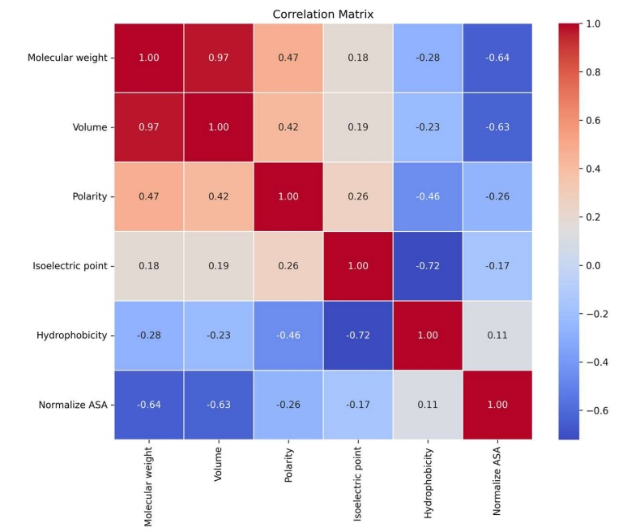

# RGTFormer: Categorical Gated Transformer + Relational Graph Convolutional Network
### Predicting Mutation-Associated Multi-Drug Resistance in *Mycobacterium tuberculosis*

**Authors:**  
Rakesh Chandra Joshi¹, Hitesh Reddy Dereddy², Sandip Mukhopadhyay³, Radim Burget⁴, Malay Kishore Dutta¹*  
¹ Amity Centre for Artificial Intelligence, Amity University, Noida, India  
² Department of Artificial Intelligence, Amity School of Engineering & Technology, Amity University, Noida, India  
³ ICMR–National Institute for Research in Bacterial Infections, Kolkata, India  
⁴ Brno University of Technology, Czech Republic  
*Corresponding Author: malaykishoredutta@gmail.com*

---

## Overview
**RGTFormer** integrates a **Categorical Gated Transformer (CGT)** with a **Relational Graph Convolutional Network (RGCN)** to predict mutation-associated resistance to first- and second-line anti-tuberculosis (TB) drugs.  
It learns from both **sequence-based categorical** and **structure-based numerical** mutation descriptors to model multi-gene, multi-drug resistance with interpretability and efficiency.

---

## Abstract
Tuberculosis (TB), caused by *Mycobacterium tuberculosis*, remains a global health threat, worsened by multi-drug-resistant TB (MDR-TB). Resistance often stems from single-nucleotide mutations in key genes.  
RGTFormer fuses RGCN-based relational reasoning and Transformer-based categorical attention to predict resistance from mutation profiles.  
Evaluated on 753 curated mutations across six genes (*rpoB, katG, inhA, pncA, gyrA, gyrB*), the model achieved:  
- **Independent-test accuracy:** 98.67 %  
- **10-fold CV accuracy:** 97.15 %  
- **Precision:** 100 % **Recall:** 97.37 % **F1:** 98.67 %

---

## Key Contributions
- **Hybrid architecture** combining relational (RGCN) and categorical (CGT) feature learning.
- Handles heterogeneous genomic features — physicochemical + residue/structure.
- Attention-based fusion ensures interpretability and robustness.
- Multi-gene, multi-drug generalization across six resistance genes.
- Outperforms all classical ML and deep-learning baselines.
- SHAP analysis reveals biologically meaningful feature contributions.

---

## Dataset

| Gene | Drug             | Database       | Final Variants | Resistant | Susceptible |
|------|------------------|----------------|----------------|-----------|-------------|
| rpoB | Rifampin         | TBDReaMDB [20] | 134            | -         | -           |
|      |                  | GMTV [19]      | 198            | -         | -           |
|      |                  | **Total**      | **114**        | **50**    | **64**      |
| inhA | Isoniazid        | TBDReaMDB      | 13             | -         | -           |
|      |                  | GMTV           | 30             | -         | -           |
|      |                  | **Total**      | **27**         | **10**    | **17**      |
| katG | Isoniazid        | TBDReaMDB      | 273            | -         | -           |
|      |                  | GMTV           | 83             | -         | -           |
|      |                  | **Total**      | **250**        | **135**   | **115**     |
| pncA | Pyrazinamide     | TBDReaMDB      | 278            | -         | -           |
|      |                  | GMTV           | 137            | -         | -           |
|      |                  | **Total**      | **241**        | **139**   | **102**     |
| gyrA | Fluoroquinolones | TBDReaMDB      | 17             | -         | -           |
|      |                  | GMTV           | 112            | -         | -           |
|      |                  | **Total**      | **72**         | **31**    | **41**      |
| gyrB | Fluoroquinolones | TBDReaMDB      | 18             | -         | -           |
|      |                  | GMTV           | 72             | -         | -           |
|      |                  | **Total**      | **49**         | **28**    | **21**      |

**Total:** 753 mutations **Labels:** ΔΔG < 0 → Resistant; ΔΔG ≥ 0 → Susceptible

---

## Feature Engineering

**Numerical (z-score normalized mutant–wild-type differences):**
1. Molecular weight  
2. Van der Waals volume  
3. Polarity  
4. Isoelectric point  
5. Hydrophobicity  
6. Normalized ASA

**Categorical:**
- Residue type (0 charged / 1 polar / 2 aromatic / 3 hydrophobic)
- Secondary structure (1 helix / 2 sheet / 3 coil / 4 turn)

---

## Methodology

### Workflow


### Model Architecture
**RGTFormer = RGCN + CGT + Attention Fusion**  


#### **RGCN Layer**
$$
h_i^{(l+1)} = \sigma\left( \sum_{r \in \mathcal{R}} \sum_{j \in \mathcal{N}_i^r} \frac{1}{c_{i,r}} W_r^{(l)} h_j^{(l)} \right)
$$


#### **CGT (Gated Transformer)**
$$
\begin{aligned}
z &= \operatorname{ReLU}(Wx + b), \\
&\quad GLU(z,g) = z \cdot \sigma(g) \\
\\
m &= \operatorname{Softmax}(Wx + b), \\
&\quad x'_i = x_i \odot m
\end{aligned}
$$


#### **Fusion + Classification**
\[
h=\alpha h_{RGCN}+\beta h_{CGT},\;\alpha+\beta=1,\quad
y=Softmax(Wh+b)
\]

**Training:** Adam (β₁ = 0.9, β₂ = 0.999), 100 epochs, BCE loss, PyTorch on NVIDIA A100 (40 GB)

---

## Experimental Results

| Variant | GNN Dim | Layers | LR       | CGT Dim | Accuracy (%) | Precision (%) | Recall (%) | F1 (%) |
|:-------:|--------:|-------:|----------:|--------:|-------------:|--------------:|-----------:|-------:|
| V1      | 64      | 3      | 0.001    | 64      | 97.35        | 98.65         | 96.05      | 97.33  |
| **V2 (Best)** | **128** | **4**  | **0.0005** | **128** | **98.67**    | **100.00**    | **97.37**  | **98.67** |
| V3      | 32      | 2      | 0.002    | 32      | 94.70        | 97.22         | 92.11      | 94.59  |

### Ablation & Baselines

| Model                          | 10-Fold Acc (%) | Test Acc (%) | Precision (%) | Recall (%) | F1 (%) |
|-------------------------------|-----------------|--------------|---------------|------------|--------|
| **RGTFormer Full**            | **97.15**       | **98.67**    | **100.00**    | **97.37**  | **98.67** |
| RGCN only                     | 94.57           | 96.02        | 97.30         | 94.74      | 96.00  |
| CGT only                      | 67.81           | 68.87        | 69.33         | 68.42      | 68.87  |
| GCN + Vanilla Transformer     | 65.36           | 66.89        | 72.41         | 55.26      | 62.69  |

### Classical ML Comparison (Independent Test Set Accuracy %)

| SVM   | RF    | Extra Trees | XGBoost | KNN   | MLP (Complex) | ANN   | **RGTFormer** |
|-------|-------|-------------|---------|-------|---------------|-------|---------------|
| 90.07 | 93.38 | 92.72       | 95.36   | 95.36 | 94.70         | 94.04 | **98.67**     |

**ROC AUC = 0.9923 (149 / 151 correct)**  
| Confusion Matrix | ROC Curve |
|:----------------:|:---------:|
|  |  |

---

## Explainability – SHAP
  
**Hydrophobicity ≫ Molecular Weight ≫ Isoelectric Point ≫ ASA** as key features.

---

## Appendix Summary

| Feature            | Mean    | Std     | Min   | Max  |
|--------------------|---------|---------|-------|------|
| Mol Weight         | −0.0013 | 0.2989  | −1    | 0.77 |
| Volume             | 0.005   | 0.2917  | −1    | 0.8  |
| Polarity           | −0.0277 | 0.549   | −1    | 1    |
| pI                 | 0.0232  | 0.2956  | −0.71 | 0.87 |
| Hydrophobicity     | −0.0456 | 0.3268  | −0.92 | 0.92 |
| Norm ASA           | 0.4797  | 0.2721  | 0     | 1    |

### Correlation Matrix


---

## Comparison with Existing Studies

| Study                | Method                | Drugs                  | Accuracy | Remarks                          |
|----------------------|-----------------------|------------------------|----------|----------------------------------|
| Hadikurniawati 2023  | Classical ML          | RIF INH PZA EMB        | ~99      | No graph features                |
| CRyPTIC 2022         | ML on WGS             | 13                     | >95      | Low interpretability             |
| Jamal 2020           | ML + Docking          | 4                      | ~85      | High runtime                     |
| Bhaskar 2023         | CNN on CT + Genomics  | –                      | 97.27    | No mutation-level                |
| **RGTFormer**        | CGT + RGCN            | 6                      | **98.67**| Interpretable + efficient         |

---

## Key Takeaways
- Hybrid graph-transformer captures **relational + contextual** dependencies.
- Mutation-level reasoning enhances **interpretability**.
- SHAP reveals **biologically coherent** physicochemical drivers.
- Extensible to **other antimicrobial resistance tasks**.

---

## Implementation

**Environment**
```bash
Python >=3.10
PyTorch >=2.1
scikit-learn pandas numpy shap matplotlib networkx
